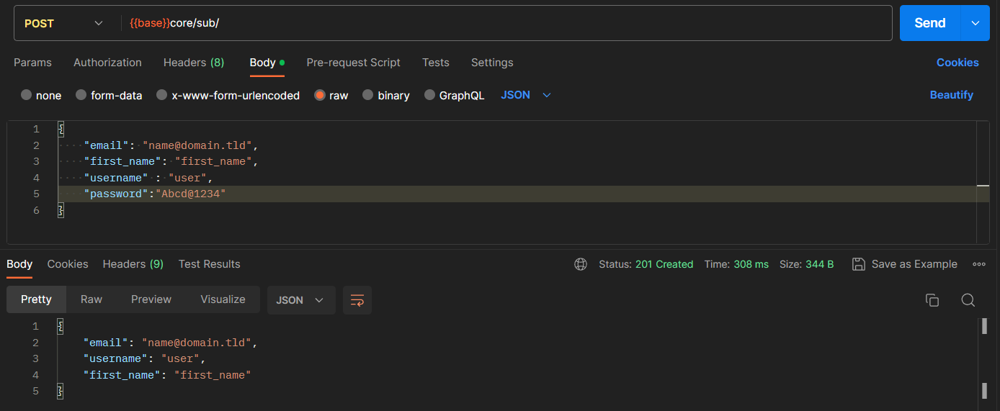
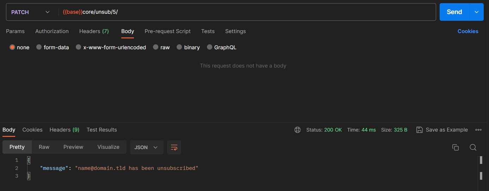
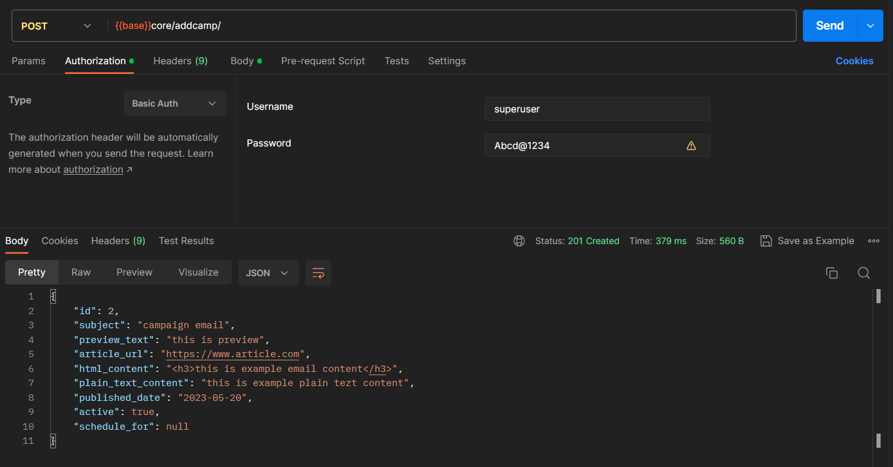
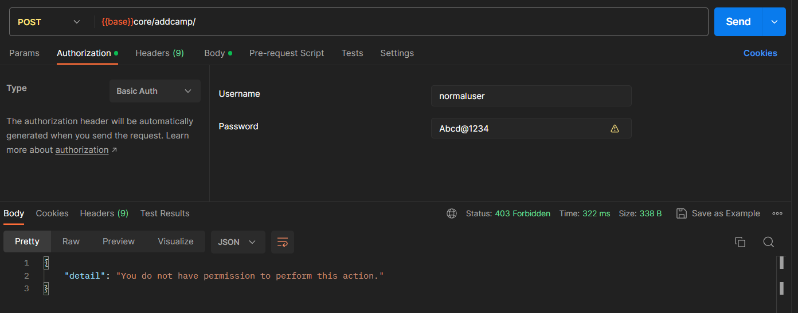
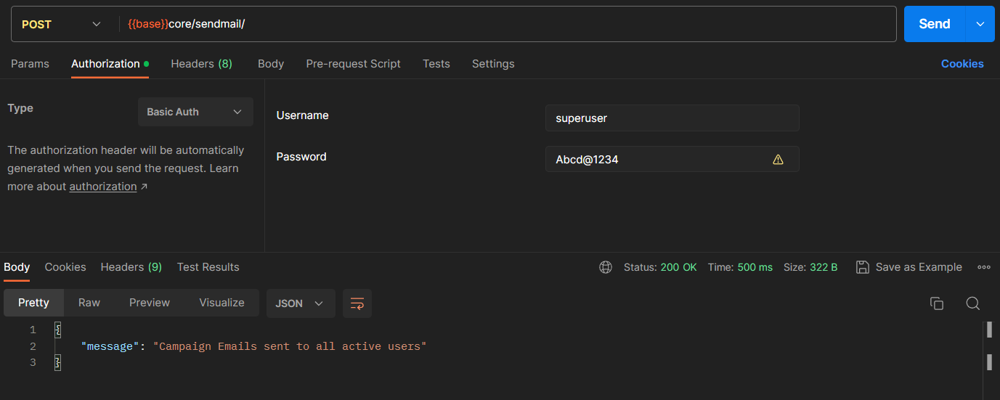
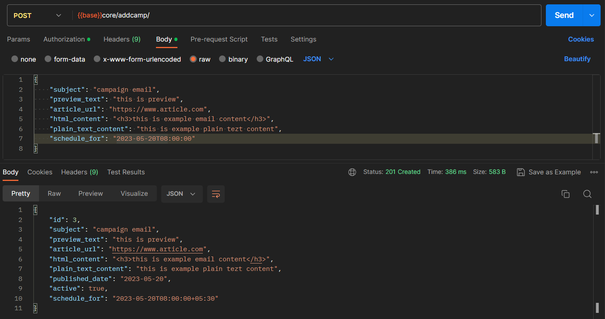

# <p align = "center"> Features </p>

### <p align = "center">1. Subscribe to mailing list </p>


### <p align = "center">2. Unsubscribe from mailing list </p>


### <p align = "center">3. Add Campaigns (only for admin users) </p>



### <p align = "center">4. Send Campaign Emails to all active users </p>
#### <p align = "center"> Emails are sent through Celery Group due to which response time is significantly reduced </p>


### <p align = "center">5. Add Scheduled Campaigns </p>
#### <p align = "center"> At a specified date and time, scheduled campaigns are automatically dispatched to all active users via email. </p>


## How to setup the project on your local server?

1. Clone the repository:

```CMD
git clone https://github.com/anshumannandan/CampaignMailer
```
To run the server, you need to have Python installed on your machine. If you don't have it installed, you can follow the instructions [here](https://www.geeksforgeeks.org/download-and-install-python-3-latest-version/) to install it.

2. Navigate to the project directory: 

```CMD
cd CampaignMailer
```

3. Install & Create a virtual environment:

```CMD
pip install virtualenv
virtualenv venv
```

4. Activate the virtual environment:
```CMD
venv/scripts/activate
```

5. Install the dependencies: 

```CMD
pip install -r requirements.txt
```

6. Setup .env file in CampaignMailer/project/ and navigate back to base directory CampaignMailer/:
```
SECRET_KEY =
DEBUG = 
EMAIL_HOST = 
EMAIL_PORT = 
EMAIL_HOST_USER = 
EMAIL_HOST_PASSWORD = 
EMAIL_USE_TLS =
```

7. Run the migrate command:
```CMD
python manage.py migrate
```

8. You can create a superuser executing the following commands:
```CMD
python manage.py createsuperuer
```
A prompt will appear asking for username, email followed by password. 

9. Run the backend server on localhost:

```CMD
python manage.py runserver
```

You can access the endpoints from your web browser following this url:
```url
http://127.0.0.1:8000
```

To access the django admin panel follow this link and login through superuser credentials:
```url
http://127.0.0.1:8000/admin/
```

10. To run the celery worker, you need to have Redis installed on your machine. If you don't have it installed, you can download and install it from [here](https://github.com/tporadowski/redis/releases).

11. Run celery worker (On a separate terminal with activated virtual environment):

```CMD
celery -A cryptBEE.celery worker -l info
```